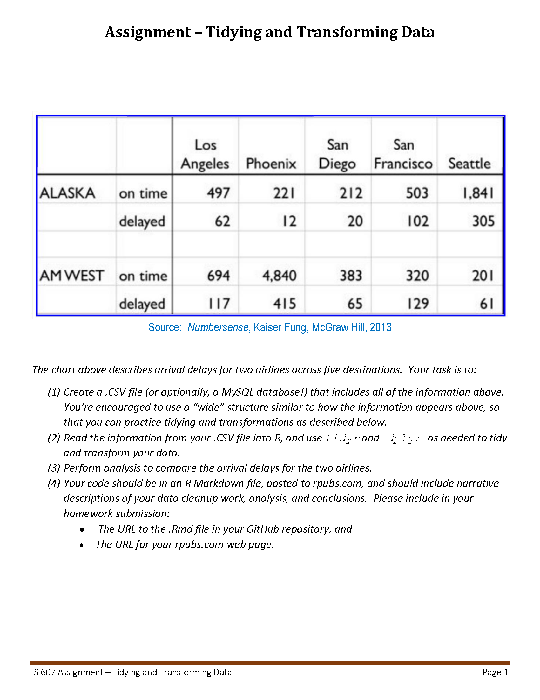

```{r setup, include=FALSE}
knitr::opts_chunk$set(echo = TRUE)
library(tidyverse)
library(DBI)
library(RMySQL)
```

## Assignment Week #5
```{r}

```

### Import Untidy Data from MySQL Database

```{r database}
flight_db <- dbConnect(MySQL(), user = "aconrardy", password = "DocGraduate2024*", dbname = 'assignment_week_5', host = "data607b.mysql.database.azure.com")

flight_data <- dbReadTable(flight_db, "flight_data")
flight_data
```

### Tidying and Transforming the Data

In this section we are going to clean up the data so that it is "tidy" and able to be analyzed efficiently.  The above data was structured to have eight (8) columns containing various information for the different airlines.  This can be reduced to four (4) columns to identify carrier, airport, status (on-time/delayed) and the number of flights.  The totals for the airline could be ignored because they can be calculated simply by adding the number of on time and delayed flights.  The "ident_city" column can also be ignored for this assignment, but if it is needed to link to another dataset the ident_city column may become necessary.  We will use the Tidyr package and pivot each carrier column, and then bind the rows together in a long format.  We are then reducing the number of initial variables from eight (8) to four (4), but increasing the number of rows from five (5) to twenty (20).

```{r tidyr}
# We are going to split the column label to form the "carrier" and "status" columns, then place the values into the "count" column.  Then pull out the new columns and re-assign back into the new data frame.
flight_data1 <- flight_data |> pivot_longer(
 cols = (alaska_ontime),
 names_to = c("carrier", "status"),
 names_sep = "_",
 values_to = "count")
flight_data1 <- flight_data1 |> select(arrival_city, carrier, status, count)

# We are the going to do the same for each of the other columns in the data frame, establishing a total of four (4) new data frames.
flight_data2 <- flight_data |> pivot_longer(
 cols = (alaska_delayed),
 names_to = c("carrier", "status"),
 names_sep = "_",
 values_to = "count")
flight_data2 <- flight_data2 |> select(arrival_city, carrier, status, count)
 
flight_data3 <- flight_data |> pivot_longer(
 cols = (amwest_ontime),
 names_to = c("carrier", "status"),
 names_sep = "_",
 values_to = "count")
flight_data3 <- flight_data3 |> select(arrival_city, carrier, status, count)
 
flight_data4 <- flight_data |> pivot_longer(
cols = (amwest_delayed),
names_to = c("carrier", "status"),
names_sep = "_",
values_to = "count")
flight_data4 <- flight_data4 |> select(arrival_city, carrier, status, count)

# We are then going to row bind the four (4) new data frames to establish our new data frame for analysis.
tidy_data <- rbind(flight_data1,flight_data2,flight_data3,flight_data4)
tidy_data

```

### Data Analysis

We can now start our analysis of the data we tidied and transformed in the previous section.  We are also going to do some additional changes so the resulting plots look appropriate.  In this section, we are going to:

1)  rename a column to avoid confusion between a variable name and an R function.

2)  calculate the total number of flights coming into each arrival city from both carriers.

3)  calculate the percentage of on-time and delayed flights for each carrier as it relates to the overall flights coming into the arrival city.

4)  calculate the on-time and delayed flight percentage for each carrier. 

5)  Re-label the carrier names so it looks better on our graphic display.

```{r}
# We are going to rename a column because we are having difficulties differentiating the name "count" from the function count.  So we are going to rename our "count" column to "num_flight"

tidy_data <- tidy_data |> rename(num_flight = count)

# We are going to establish new label names for the carriers.
new_labels <- c("alaska" = "Alaska Airlines", "amwest" = "Am West Airlines")

# We are going to identify the total number of flights coming into each arrival city
total_counts <- aggregate(num_flight ~ arrival_city, tidy_data, sum)

# We are going to identify the number of flights coming into an arrival city and total their status for each carrier.

carrier_total_counts <- tidy_data |> group_by(arrival_city, carrier) |> summarize(carrier_total=sum(num_flight), .groups = "keep")

# We are then going to merge the total number of flights back into the original data frame into a new column.
tidy_data1 <- merge(tidy_data, total_counts, by = "arrival_city", suffixes = c("", "_total"))

# We are then going to merge the status totals of flights back into the original data frame into a new column.
tidy_data2 <- merge(tidy_data, carrier_total_counts, by = c("arrival_city", "carrier"), suffixes = c("", "_arrival_city"))

# We are then going to create a new column calculating the percentage of the total flights into the arrival city that each carrier has either on-time or delayed.  We could have done this in a later section, but it made more sense to complete any final transformations at this point to just focus on the analysis.
# This could have also been done using mutate.
# tidy_data1 <-  tidy_data1 |> mutate(percentage_total = (num_flight / num_flight_total) * 100)
tidy_data1$percentage_total <- (tidy_data1$num_flight / tidy_data1$num_flight_total)*100

# We are then going to create a new column calculating the carrier percentage total of delayed and on-time flights into the arrival city.  We will use mutate for this application.
tidy_data2 <- tidy_data2 |> mutate(carrier_percentage_total = (num_flight / carrier_total) * 100)

```


In this section we are going to present our first graphic, a column plot indicating the total number of flights coming into five arrival cities.  We can clearly see that Phoenix receives the highest volume of flights from the two carriers (Alaska and Am West), followed by Seattle.  We can also see that San Diego receives the least number of flights.

```{r plot1}
 ggplot(total_counts, aes(x = arrival_city, y = num_flight)) +
   geom_col(fill = "dark green") +
     labs(x = "Arrival City",
          y = "Number of Flights",
          title = "Total Number of Flights by Arrival City", 
          subtitle = "Figure #1") +
      geom_text(aes(label=paste0(num_flight)),
            position = position_dodge(width = 0.9),
            vjust = -0.5,
            size = 3) +
   theme(axis.text.x = element_text(angle = 45, hjust = 1)) 
```

We can continue our analysis by differentiating the carriers and their performance in each one of these arrival cities to see their individual impact on flight delays.  We will plot the percentage of the total number of flights coming into each city for both on-time and delayed flights for each carrier.  Using facet_wrap makes this option much easier, and we will place the new labels on top of each panel.

```{r}
ggplot(tidy_data1, aes(x = arrival_city, y = percentage_total, fill = status)) + 
  geom_col(position = "dodge") +
  facet_wrap(~carrier, labeller = labeller(carrier = new_labels)) +
  geom_text(aes(label=paste0(round(percentage_total), "%")),
            position = position_dodge(width = 0.9),
            vjust = -0.5,
            size = 3) +
  labs(x = "Arrival City",
       y = "Percentage of Total Flights Into Arrival City",
       title = "On-time/Delayed Performance",
       subtitle = "Figure #2-Alaska and Am West Airlines",
       fill = "Status") +
  theme(axis.text.x = element_text(angle = 45, hjust = 1)) +
  scale_fill_manual(values = c("delayed" = "red", "ontime" = "dark green"),
                    labels = c("Delayed Flights", "On-time Flights"))
```


We are going to create one more graphic to further investigate on time performance.  We can compare the percentage of the individual carriers flights into a specific arrival city, rather than the overall number of flights, to see if a particular carrier has a "problem" area.The Official Airline Guide (OAG) publishes available data for the airline industry and can be accessed via https://www.oag.com/.  It has been suggested that an on time performance of 90% or better is considered "exceptional", while 80% or above is considered "pretty good".  For our purposes, we will consider anything less than 80% on-time performance, or greater than 20% delayed arrival, to be insufficient.


```{r}
ggplot(tidy_data2, aes(x = arrival_city, y = carrier_percentage_total, fill = status)) + 
  geom_col(position = "dodge") +
  facet_wrap(~carrier, labeller = labeller(carrier = new_labels)) +
  geom_text(aes(label=paste0(round(carrier_percentage_total), "%")),
            position = position_dodge(width = 0.9),
            vjust = -0.5,
            size = 3) +
  labs(x = "Arrival City",
       y = "Percentage of Carrier Flights",
       title = "On-time/Delayed Performance",
       subtitle = "Figure #3-Alaska and Am West Airlines",
       fill = "Status") +
  theme(axis.text.x = element_text(angle = 45, hjust = 1)) +
  scale_fill_manual(values = c("delayed" = "red", "ontime" = "dark green"),
                    labels = c("Delayed Flights", "On-time Flights"))
```


### Findings and Conclusions

We can immediately see some interesting findings from our analysis and graphic representations.  While Phoenix is the arrival city with the most flights (Figure #1), Am West is the carrier that accounts for 96% of the flights coming into that city and accounts for the largest percentage of delayed flights (Figure #2-8% vs <1%). However, we can also see by the graphic output that the percentage of delayed flights into Phoenix by each carrier indicates that Am West has a larger percentage of delayed flights as compared to Alaska (Figure #3-8% vs 5%). Alaska Airlines is the carrier that accounts for 89% of the flights going into Seattle, with a much larger percentage of the overall delayed flights than Am West (13% vs. 3%).  

The point of concern may be the indication that Am West has arrival delay problems into both Seattle and San Francisco, delayed flights 23% and 29% respectively (Figure #3), though they account for a much smaller percentage of the overall flights into those cities, 8% and 30% respectively (Figure #2).  Am West may want to focus resources to improve on-time performance toward "pretty good". 

